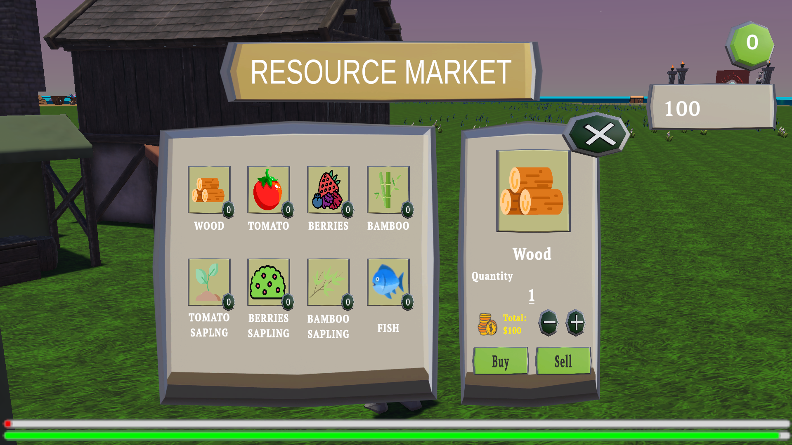

<h1 align="center"> MoonriSe </h1> <br>
<p align="center">
  <a href="">
    
  </a>
</p>

<p align="center">
  Unity TPA Game Project: 94.66 / 100 (Duration: 2 weeks)
</p>

<!-- START doctoc generated TOC please keep comment here to allow auto update -->
<!-- DON'T EDIT THIS SECTION, INSTEAD RE-RUN doctoc TO UPDATE -->
## Table of Contents

- [MoonriSe Documentation](#introduction)
- [Download Game](#download)
- [Prerequisite](#prerequisite)
- [Game Display](#game-display)
- [Game Clip](#game-clip)

<!-- END doctoc generated TOC please keep comment here to allow auto update -->

## **MoonriSe** 🌖🌙

### **Introduction**
Welcome to **MoonriSe**, a captivating adventure set in a vibrant open world where players can farm, trade, explore, and battle their way to survival. Built in **Unity**, this game offers a unique blend of peaceful farming life and thrilling dungeon crawling, creating an immersive experience reminiscent of **Stardew Valley** but with a darker twist.

### Technology and Infrastructure

- **Game Engine**: Unity (version 6000.0.25f1)
- **IDE**: Visual Studio or Visual Studio Code
- **Programming Language**: C#

###  **Core Features**
#### 🌿 **Farming & Fishing**
- Grow a variety of crops and manage your farm.
- Engage in **fishing** to catch different types of fish.
- Trade your harvested goods for valuable items.

#### 🤝 **NPC Trade & Buy System**
- Interact with **NPC merchants** to buy and sell items.
- Discover unique and powerful equipment to aid in exploration.

#### 🏰 **Procedural Dungeon Exploration**
- Explore dungeons that change every time you enter.
- Face challenging **zombies** and uncover hidden treasures.

#### ⚔️ **Level Up the World**
- Improve your world by **exploring new areas** and **defeating zombies**.
- Unlock new opportunities and resources as you progress.

### **Gameplay Overview**
Players start with a small farm and limited resources, gradually expanding their influence by engaging in farming, trading, and exploring. As they venture deeper into dungeons, they will face terrifying enemies, collect loot, and strengthen their abilities.

Survival is key, but so is **strategic management**—balancing peaceful activities with thrilling combat to shape the world around them.

### **Conclusion**
MoonriSe is an exciting mix of **farming, adventure, and survival**, offering endless possibilities for players who love both relaxation and challenge. Whether you enjoy **building a thriving farm**, **battling zombies**, or **exploring dungeons**, MoonriSe provides a dynamic and rewarding experience!

## Download

You can try my game via this link (Download all of the Assets) : https://bit.ly/TPA-MoonriSe


## Prerequisite

Before running this project in Unity, ensure the following requirements are met:

1. **Unity Hub and Unity Editor:**
   - Download and install Unity Hub from [Unity Hub](https://unity.com/download).
   - Inside Unity Hub, install Unity Editor version **6000.0.25f1** or newer. Ensure the "Game Development with Unity" module is selected during installation.
   - Open Unity Hub and activate a valid license if not done already.

2. **Git:**
   - Git is required to clone the repository. Download Git from [here](https://git-scm.com/).
   - Verify Git installation by running the following command:

     ```bash
     git --version
     ```

     If the version appears, Git is successfully installed.

3. **Supported Hardware:**
   - Minimum specifications:
     - **Processor**: Quad-core CPU or better.
     - **RAM**: 8 GB (16 GB recommended).
     - **Graphics Card**: DirectX 11 compatible.
     - **Storage**: At least 10 GB free space for the project.

4. **Optional Tools:**
   - **Visual Studio (2022)** with Unity Tools for better coding experience. Download from [Visual Studio](https://visualstudio.microsoft.com/).
   - Install the C# and Unity workloads during setup.

## How to Run Project Locally

Because, right now I'm not building the project, so you should run the project locally. Follow these steps:

1. **Clone Repository:**
   - Open a terminal or Git Bash and clone the repository to your local machine:

     ```bash
     git clone https://github.com/StyNW7/TPA-MoonriSe.git
     ```

   - Navigate to the project directory:

     ```bash
     cd MoonriSe
     ```

2. **Open Project in Unity:**
   - Launch Unity Hub and click "Open Project."
   - Select the `MoonriSe` folder where you cloned the repository.
   - Unity will load the project. This may take some time depending on the assets and resources included in the project.

3. **Resolve Missing Dependencies:**
   - If any packages or dependencies are missing, Unity will notify you. Follow these steps:
     - Open the **Package Manager** in Unity (`Window > Package Manager`).
     - Install any required packages, such as `Cinemachine`, `TextMeshPro`, or `Post Processing`.

4. **Run the Game:**
   - To test the game, press the **Play** button in the Unity Editor.
   - Ensure the "Game" tab is active to view the gameplay.

5. **Optional Build:**
   - To create a standalone build of the game:
     - Go to `File > Build Settings`.
     - Select your target platform (e.g., Windows, macOS) and click "Build."
     - Choose a destination folder for the build files and wait for Unity to generate the executable.

6. **Debugging:**
   - Use the Unity Console (`Window > General > Console`) to monitor logs, warnings, and errors during testing.
   - Inspect objects and scripts in the Scene and Hierarchy to troubleshoot any issues.


## Game Display

Here are some snapshots of MoonriSe:

* Start Menu - Where the Journey Begins

<p align="center">
  
</p>

* Resoucr Market Menu - Time to get resources

<p align="center">
  
</p>

## Game Clip

Here are some cool actions of MoonriSe:

* Combat - Duel between Hero and Zombie using State Pattern.

<p align="center">
  
  <!-- <video src = "./Images/Video-1.mp4"></video> -->
</p>


* Fishing - Tired with Combat? Just go play the fishing mini games.

<p align="center">
  
  <!-- <video src = "./Images/Video-2.mp4"></video> -->
</p>


<!-- ##### Hopefully, this documentation and guide are helpful for learning and running the game project! -->

<!-- Owner -->

## Owner

This Repository is created by (Project last modified Friday, 14 February 2025):
- Stanley Nathanael Wijaya (NW25-1)

## 📧 Contact Information
If any questions occured, or in the need of any discussion or details,
please contact me:
- Email : stanley.n.wijaya7@gmail.com
- Discord : stynw7

<code> Striving for Excellence ❤️‍🔥❤️‍🔥 </code>